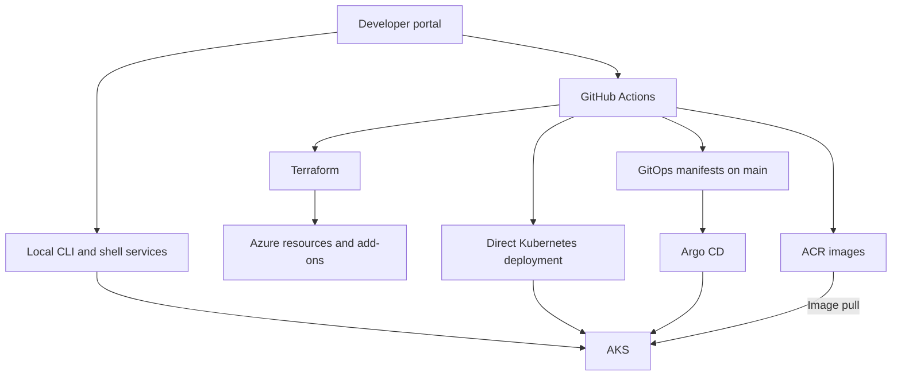

# Architecture

[Project guide](../README.md)

## System purpose

The portal is an orchestration and visibility layer over existing cloud and delivery tools. GitHub Actions performs many remote operations; the portal host also performs local CLI queries and can execute local shell automation. These are distinct execution contexts with separate credentials and failure modes.

## Component responsibilities

| Layer | Implementation | Responsibility |
|---|---|---|
| Presentation | Flask, Jinja, CSS, JavaScript | Pages, forms, inventory, and status polling |
| Integration | Python services | GitHub API dispatch, CLI calls, report parsing |
| Automation | GitHub Actions and Bash | Infrastructure lifecycle, releases, operations |
| Desired infrastructure | Terraform roots and modules | Azure resources, Helm releases, selected Kubernetes objects |
| Desired applications | GitOps manifests | Argo CD-managed application resources |
| Runtime | AKS | Application containers and platform add-ons |
| Evidence | Git history, CSV, JSON, workflow artifacts | Deployment records and security findings |

## Release sequence

The manually dispatched release workflow selects an application, environment, deployment strategy, deployment type, and optional DevSecOps checks. It invokes the reusable build workflow, producing an ACR image tagged with the initiating Git SHA.

Traditional deployment renders image and identity placeholders into temporary manifests and applies them to Kubernetes. GitOps deployment edits tracked desired manifests, pushes them to main, creates an Argo CD Application if missing, and waits for reconciliation and rollout.

The security-enabled release path adds a scan and policy evaluation before deployment. Its current evidence-transfer limitations are explained in the [security guide](../../app/security/README.md).

## Traffic paths

NGINX Ingress routes application URL prefixes to ClusterIP Services. Tetris receives traffic on container port 80; Tic-Tac-Toe receives it on 5001 through Service port 80.

Istio provides another entry path through its ingress gateway and platform Gateway. VirtualServices rewrite application prefixes and route between version subsets defined by DestinationRules. Baseline configuration assigns 100% to v1 and 0% to v2.

The existence of Istio resources does not prove that all workload traffic traverses sidecars. Namespace injection, pod sidecars, gateway traffic, and policies must be checked in the live cluster. NGINX and Istio are separate entry mechanisms.

## State and ownership

| State | Location | Important boundary |
|---|---|---|
| Core infrastructure | Azure Blob backend, terraform.tfstate | Shared root; environment input does not change state key |
| Argo CD, monitoring, logging, mesh | Separate backend keys | Each add-on is a separate Terraform root |
| DevSecOps storage | Add-on root with empty backend.tf | Durable remote state is not configured there |
| Desired app resources | gitops/applications on main | Argo CD prune and self-heal enabled |
| Local jobs | Python process memory | Not durable across restarts or shared reliably across processes |
| Portal deployment context | Python process memory | Not a persistent per-user release record |
| Reports and history | Repository files and Actions artifacts | May be stale or incomplete |

Terraform defines mesh VirtualServices, but traffic-shift and rollback workflows modify live VirtualServices directly. A later Terraform reconciliation may restore its configured values. Direct changes to an Argo CD-managed application may likewise be reverted by self-healing.

## Identity boundaries

The portal reads GitHub credentials from environment variables. Workflows commonly use AZURE_CREDENTIALS for Azure service-principal login; GitOps writes also use an SSH key. AKS uses managed identities for ACR pulls and the Key Vault CSI integration. These identities serve different purposes.

No portal SSO or application-level role enforcement was found in the inspected Flask wiring. Repository permissions do not automatically provide access control for portal HTTP endpoints.

## Deployment topology

The default target is a single AKS cluster in Central India, with one Standard_B2s node and applications in the default namespace. This is a demonstration configuration, not a multi-cluster or highly available deployment design.

The portal depends on a host with the required command-line tools and authenticated contexts. Its Python-only Dockerfile does not establish a complete operational image. The separate flask-demo chart exists, but the current release workflow selects only the two game applications.
